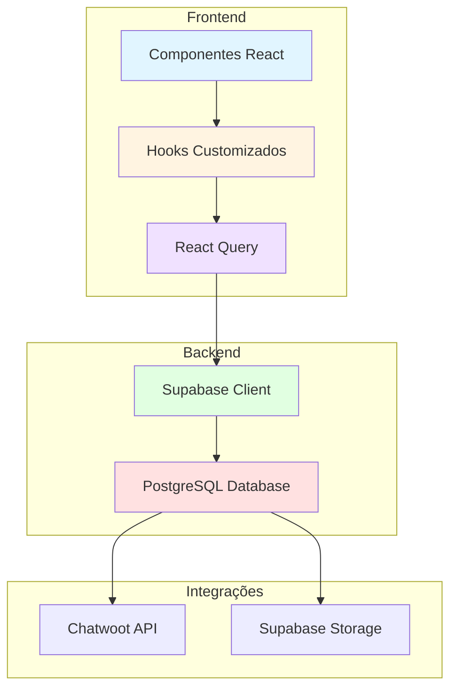
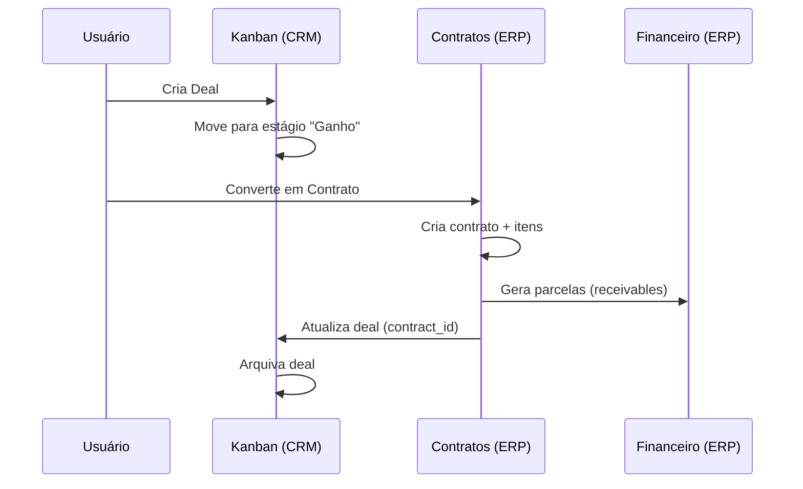
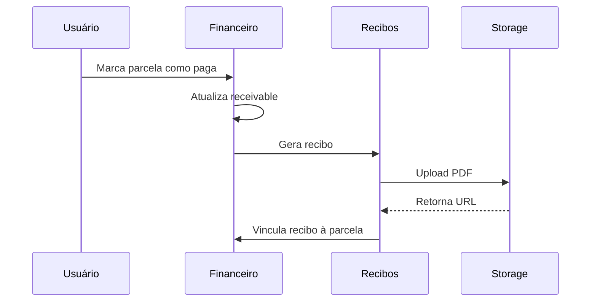

# Documentação de APIs - Sistema Kanban

> [!NOTE]
> Esta documentação descreve todas as APIs e hooks customizados utilizados no sistema Kanban integrado com CRM e ERP.

## 📋 Índice

- [Visão Geral](#visão-geral)
- [Arquitetura](#arquitetura)
- [Módulo CRM](#módulo-crm)
- [Módulo ERP](#módulo-erp)
- [Integrações](#integrações)
- [Tipos de Dados](#tipos-de-dados)
- [Exemplos de Uso](#exemplos-de-uso)

---

## Visão Geral

O sistema utiliza **React Query** para gerenciamento de estado assíncrono e **Supabase** como backend (PostgreSQL + API REST). Todas as operações de dados são encapsuladas em **hooks customizados** que seguem o padrão:

- **Queries**: Buscar dados (`useQuery`)
- **Mutations**: Criar, atualizar ou deletar dados (`useMutation`)
- **Cache Invalidation**: Atualização automática após mutações

### Tecnologias

- **Frontend**: React + TypeScript + Vite
- **State Management**: TanStack Query (React Query)
- **Backend**: Supabase (PostgreSQL + REST API)
- **Integração**: Chatwoot (CRM externo)

---

## Arquitetura



### Estrutura de Pastas

```
src/
├── hooks/              # Hooks customizados (APIs)
│   ├── useKanban.ts
│   ├── useContracts.ts
│   ├── useClients.ts
│   ├── useContacts.ts
│   ├── usePipelines.ts
│   ├── useStages.ts
│   ├── useFinancial.ts
│   ├── useDashboard.ts
│   └── ...
├── lib/
│   └── supabase.ts     # Cliente Supabase
├── types/
│   └── database.ts     # Tipos TypeScript
└── components/         # Componentes React
```

---

## Módulo CRM

O módulo CRM gerencia o funil de vendas (Kanban), contatos e negociações.

### 🎯 useKanban

Gerencia pipelines, estágios e deals (negociações) no Kanban.

#### Queries

##### `pipelines`

Busca todos os pipelines filtrados por permissões do usuário.

```typescript
const { pipelines, pipelinesLoading } = useKanban();
```

**Retorno**: `Pipeline[]`

**Tabela**: `crm_pipelines`

**Filtros**: `chatwoot_inbox_id IN (allowedInboxIds)`

---

##### `stages`

Busca estágios de um pipeline específico.

```typescript
const { stages, stagesLoading } = useKanban(pipelineId);
```

**Parâmetros**:

- `pipelineId` (string): ID do pipeline

**Retorno**: `Stage[]`

**Tabela**: `crm_stages`

**Ordenação**: Por `position`

---

##### `deals`

Busca deals (negociações) de um pipeline, excluindo arquivados.

```typescript
const { deals, dealsLoading } = useKanban(pipelineId);
```

**Parâmetros**:

- `pipelineId` (string): ID do pipeline

**Retorno**: `Deal[]` (com dados do contato relacionado)

**Tabela**: `crm_deals`

**Joins**: `crm_contacts`

**Filtros**: `is_archived = false`

---

#### Mutations

##### `updateDealStage`

Move um deal para outro estágio (drag & drop).

```typescript
const { updateDealStage, isUpdating } = useKanban(pipelineId);

updateDealStage({
  dealId: "uuid",
  stageId: "uuid",
});
```

**Invalidação**: `['deals', pipelineId]`

---

##### `updateDeal`

Atualiza informações de um deal.

```typescript
const { updateDeal } = useKanban(pipelineId);

updateDeal({
  dealId: "uuid",
  updates: {
    title: "Novo título",
    deal_value_negotiated: 5000,
    priority: "high",
  },
});
```

**Invalidação**: `['deals', pipelineId]`

---

##### `createDeal`

Cria um novo deal.

```typescript
const { createDeal, isCreating } = useKanban(pipelineId);

createDeal({
  pipeline_id: "uuid",
  stage_id: "uuid",
  title: "Nova negociação",
  deal_value_negotiated: 10000,
  priority: "medium",
  contact_id: 123,
});
```

**Invalidação**: `['deals', pipelineId]`

---

##### `deleteDeal`

Remove um deal.

```typescript
const { deleteDeal, isDeleting } = useKanban(pipelineId);

deleteDeal({ dealId: "uuid" });
```

**Invalidação**: `['deals', pipelineId]`

---

### 👥 useContacts

Gerencia contatos do CRM.

#### Queries

##### `contacts`

Busca todos os contatos com filtro de busca opcional.

```typescript
const { contacts, isLoading, searchQuery, setSearchQuery } = useContacts();

// Filtrar contatos
setSearchQuery("João");
```

**Retorno**: `Contact[]`

**Tabela**: `crm_contacts`

**Busca**: Por `name`, `phone` ou `email` (case-insensitive)

---

#### Mutations

##### `updateContact`

Atualiza dados de um contato.

```typescript
const { updateContact } = useContacts();

updateContact({
  contactId: 123,
  updates: {
    name: "João Silva",
    phone: "11999999999",
    email: "joao@example.com",
  },
});
```

---

##### `createContact`

Cria um novo contato.

```typescript
const { createContact, isCreating, createContactResult } = useContacts();

createContact({
  chatwoot_id: -1, // Negativo para contatos "balcão"
  name: "Maria Santos",
  phone: "11988888888",
  email: "maria@example.com",
  profile_url: null,
});
```

**Retorno**: `Contact` (com ID gerado)

---

### 📊 usePipelines

Gerencia pipelines (funis de vendas).

#### Queries

##### `pipelines`

Busca todos os pipelines.

```typescript
const { pipelines, isLoading } = usePipelines();
```

**Retorno**: `Pipeline[]`

**Tabela**: `crm_pipelines`

**Ordenação**: Por `created_at`

---

#### Mutations

##### `createPipeline`

Cria um novo pipeline.

```typescript
const { createPipeline } = usePipelines();

createPipeline({
  name: "Vendas Corporativas",
  chatwoot_inbox_id: "123",
});
```

---

##### `updatePipeline`

Atualiza um pipeline.

```typescript
const { updatePipeline } = usePipelines();

updatePipeline({
  id: "uuid",
  updates: { name: "Novo nome" },
});
```

---

##### `deletePipeline`

Remove um pipeline (cascade delete para stages e deals).

```typescript
const { deletePipeline } = usePipelines();

deletePipeline("uuid");
```

> [!WARNING]
> A exclusão de um pipeline remove **todos** os estágios e deals relacionados devido ao `ON DELETE CASCADE`.

---

### 📈 useDashboard

Calcula métricas do dashboard.

#### Queries

##### `metrics`

Calcula métricas de vendas.

```typescript
const { metrics, isLoading } = useDashboard();

// metrics = {
//   totalSales: 150000,
//   activeLeads: 45,
//   conversionRate: 23.5,
//   averageTicket: 5000
// }
```

**Cálculos**:

- **totalSales**: Soma de `deal_value_negotiated` de deals em estágios com `is_won = true`
- **activeLeads**: Contagem de deals **não** em estágios ganhos
- **conversionRate**: `(deals ganhos / total deals) * 100`
- **averageTicket**: `totalSales / número de deals ganhos`

**Tabelas**: `crm_deals`, `crm_stages`

---

## Módulo ERP

O módulo ERP gerencia clientes, contratos e finanças.

### 👤 useClients

Gerencia clientes do ERP.

#### Queries

##### `clients`

Busca todos os clientes com informações de contato.

```typescript
const { clients, isLoading } = useClients();
```

**Retorno**: `Client[]` (com join de `crm_contacts`)

**Tabela**: `erp_clients`

**Ordenação**: Por `full_name`

---

##### `activeClients`

Busca apenas clientes ativos.

```typescript
const { activeClients } = useClients();
```

**Filtro**: `is_active = true`

---

##### `useClient`

Busca um cliente específico por ID.

```typescript
const { useClient } = useClients();
const { data: client } = useClient(clientId);
```

**Parâmetros**:

- `clientId` (number): ID do cliente

**Retorno**: `Client | null`

---

##### `useClientByContactId`

Busca cliente vinculado a um contato CRM.

```typescript
const { useClientByContactId } = useClients();
const { data: client } = useClientByContactId(contactId);
```

**Parâmetros**:

- `contactId` (number): ID do contato CRM

**Retorno**: `Client | null`

**Uso**: Verificar se um contato CRM já tem cliente ERP vinculado

---

#### Mutations

##### `createClient`

Cria um novo cliente.

```typescript
const { createClient, isCreating } = useClients();

const newClient = await createClient({
  contact_id: 123,
  full_name: "João Silva",
  cpf: "12345678900",
  phone: "11999999999",
  email: "joao@example.com",
  source: "crm", // ou 'balcao'
  is_active: true,
  // ... outros campos
});
```

**Retorno**: `Promise<Client>`

---

##### `updateClient`

Atualiza dados de um cliente.

```typescript
const { updateClient } = useClients();

await updateClient({
  id: 1,
  updates: {
    phone: "11988888888",
    address: "Rua Nova, 123",
  },
});
```

---

##### `deactivateClient`

Desativa um cliente (soft delete).

```typescript
const { deactivateClient } = useClients();

await deactivateClient(clientId);
```

**Ação**: Define `is_active = false`

---

##### `searchClients`

Busca clientes por nome ou CPF.

```typescript
const { searchClients, isSearching, searchResults } = useClients();

await searchClients("João");
// searchResults contém até 10 resultados
```

---

### 📄 useContracts

Gerencia contratos do ERP.

#### Queries

##### `contracts`

Busca todos os contratos com informações relacionadas.

```typescript
const { contracts, isLoading } = useContracts();
```

**Retorno**: `Contract[]` (com joins de `companies`, `clients`, `contract_types`, `payment_methods`)

**Tabela**: `erp_contracts`

**Ordenação**: Por `created_at DESC`

---

##### `useContractsByClient`

Busca contratos de um cliente específico.

```typescript
const { useContractsByClient } = useContracts();
const { data: contracts } = useContractsByClient(clientId);
```

**Parâmetros**:

- `clientId` (number): ID do cliente

---

##### `useContract`

Busca um contrato específico.

```typescript
const { useContract } = useContracts();
const { data: contract } = useContract(contractId);
```

**Parâmetros**:

- `contractId` (number): ID do contrato

---

##### `useContractItems`

Busca itens de um contrato.

```typescript
const { useContractItems } = useContracts();
const { data: items } = useContractItems(contractId);
```

**Retorno**: `ContractItem[]`

**Tabela**: `erp_contract_items`

---

#### Mutations

##### `createContract`

Cria um novo contrato com itens.

```typescript
const { createContract, isCreating } = useContracts();

await createContract({
  contract: {
    company_id: 1,
    client_id: 1,
    contract_type_id: 1,
    contract_number: "CONT-2024-001",
    total_value: 10000,
    discount: 500,
    final_value: 9500,
    installments: 10,
    payment_method_id: 1,
    start_date: "2024-01-01",
    status: "active",
  },
  items: [
    {
      description: "Produto A",
      quantity: 2,
      unit_price: 5000,
      total_price: 10000,
    },
  ],
});
```

> [!IMPORTANT]
> Esta operação é **transacional**. Se falhar, nada é criado.

**Ações**:

1. Cria contrato em `erp_contracts`
2. Cria itens em `erp_contract_items`
3. Gera parcelas em `erp_receivables`
4. Atualiza deal vinculado (se houver)

---

##### `updateContract`

Atualiza um contrato.

```typescript
const { updateContract } = useContracts();

await updateContract({
  id: 1,
  updates: {
    status: "completed",
    notes: "Contrato finalizado",
  },
});
```

---

##### `deleteContract`

Remove um contrato.

```typescript
const { deleteContract } = useContracts();

await deleteContract(contractId);
```

> [!CAUTION]
> Remove também todos os itens e parcelas relacionadas (cascade delete).

---

### 💰 useReceivables

Gerencia contas a receber (parcelas).

#### Queries

##### `receivables`

Busca todas as contas a receber.

```typescript
const { receivables, isLoading } = useReceivables();
```

**Retorno**: `Receivable[]` (com joins de `clients`, `contracts`, `companies`)

**Tabela**: `erp_receivables`

---

##### `useReceivablesByStatus`

Filtra por status de pagamento.

```typescript
const { useReceivablesByStatus } = useReceivables();
const { data: pending } = useReceivablesByStatus("pending");
```

**Status**: `'pending' | 'paid' | 'overdue' | 'cancelled'`

---

##### `useReceivablesByClient`

Busca parcelas de um cliente.

```typescript
const { useReceivablesByClient } = useReceivables();
const { data: receivables } = useReceivablesByClient(clientId);
```

---

##### `useReceivablesByContract`

Busca parcelas de um contrato.

```typescript
const { useReceivablesByContract } = useReceivables();
const { data: receivables } = useReceivablesByContract(contractId);
```

---

#### Mutations

##### `markAsPaid`

Marca uma parcela como paga e gera recibo.

```typescript
const { markAsPaid } = useReceivables();

await markAsPaid({
  receivableId: 1,
  paidAmount: 1000,
  paymentMethodId: 1,
  generateReceipt: true, // Opcional, padrão true
});
```

**Ações**:

1. Atualiza `status = 'paid'`, `paid_date`, `paid_amount`
2. Gera recibo em `erp_receipts` (se `generateReceipt = true`)
3. Vincula recibo à parcela

---

##### `markAsOverdue`

Marca parcelas vencidas automaticamente.

```typescript
const { markAsOverdue } = useReceivables();

await markAsOverdue();
```

**Ação**: Atualiza `status = 'overdue'` para parcelas com `due_date < hoje` e `status = 'pending'`

---

##### `updateDueDate`

Altera data de vencimento.

```typescript
const { updateDueDate } = useReceivables();

await updateDueDate({
  id: 1,
  dueDate: "2024-12-31",
});
```

---

### 🧾 useReceipts

Gerencia recibos de pagamento.

#### Queries

##### `receipts`

Busca todos os recibos.

```typescript
const { receipts, isLoading } = useReceipts();
```

**Retorno**: `Receipt[]` (com joins de `clients`, `companies`, `payment_methods`)

**Tabela**: `erp_receipts`

---

##### `useReceiptsByClient`

Busca recibos de um cliente.

```typescript
const { useReceiptsByClient } = useReceipts();
const { data: receipts } = useReceiptsByClient(clientId);
```

---

##### `useReceipt`

Busca um recibo específico.

```typescript
const { useReceipt } = useReceipts();
const { data: receipt } = useReceipt(receiptId);
```

---

#### Mutations

##### `createReceipt`

Cria um recibo manualmente.

```typescript
const { createReceipt } = useReceipts();

await createReceipt({
  company_id: 1,
  client_id: 1,
  receivable_id: 1, // Opcional
  receipt_number: "REC-2024-001",
  receipt_date: "2024-01-15",
  amount: 1000,
  payment_method_id: 1,
  description: "Pagamento parcela 1/10",
});
```

---

## Integrações

### 🔗 Supabase

Cliente configurado em [supabase.ts](file:///c:/Projetos/kanban/src/lib/supabase.ts).

```typescript
import { supabase } from "@/lib/supabase";

// Exemplo de query direta
const { data, error } = await supabase
  .from("crm_deals")
  .select("*")
  .eq("pipeline_id", pipelineId);
```

**Variáveis de Ambiente**:

- `VITE_SUPABASE_URL`: URL do projeto Supabase
- `VITE_SUPABASE_ANON_KEY`: Chave pública (anon key)

---

### 💬 Chatwoot

Integração via `chatwoot_inbox_id` nos pipelines.

#### useChatwootUrl

Gera URLs para abrir conversas no Chatwoot.

```typescript
const { getChatwootUrl } = useChatwootUrl();

const url = getChatwootUrl(conversationId, inboxId);
// Retorna: https://chatwoot.example.com/app/accounts/1/conversations/123
```

**Configuração**: Armazenada em `app_settings` (chave: `chatwoot_url`)

---

### 📁 Supabase Storage

Usado para armazenar PDFs de contratos e recibos.

**Buckets**:

- `contracts`: PDFs de contratos
- `receipts`: PDFs de recibos
- `logos`: Logos para templates PDF

**Exemplo**:

```typescript
const { data, error } = await supabase.storage
  .from("contracts")
  .upload(`${contractId}.pdf`, pdfBlob);

// URL pública
const {
  data: { publicUrl },
} = supabase.storage.from("contracts").getPublicUrl(`${contractId}.pdf`);
```

---

## Tipos de Dados

Todos os tipos estão definidos em [database.ts](file:///c:/Projetos/kanban/src/types/database.ts).

### CRM

#### Pipeline

```typescript
interface Pipeline {
  id: string;
  name: string;
  chatwoot_inbox_id: string;
  created_at: string;
}
```

#### Stage

```typescript
interface Stage {
  id: string;
  pipeline_id: string;
  name: string;
  position: number;
  is_default: boolean;
  is_won: boolean; // Marca estágio como "ganho" para métricas
  created_at: string;
}
```

#### Deal

```typescript
interface Deal {
  id: string;
  pipeline_id: string;
  stage_id: string;
  contact_id: number | null;
  title: string;
  deal_value_negotiated: number;
  priority: "low" | "medium" | "high";
  chatwoot_conversation_id: string | null;
  ai_summary: string | null;
  needs_contract: boolean;
  existing_client_id: number | null;
  is_archived: boolean;
  archived_at: string | null;
  archived_reason: string | null;
  contract_id: number | null;
  created_at: string;
  updated_at: string;
  contacts?: Contact | null;
}
```

#### Contact

```typescript
interface Contact {
  id: number;
  chatwoot_id: number; // Negativo para contatos "balcão"
  name: string;
  phone: string | null;
  email: string | null;
  profile_url: string | null;
  created_at: string;
}
```

---

### ERP

#### Client

```typescript
interface Client {
  id: number;
  contact_id: number | null;
  full_name: string;
  cpf: string;
  rg_number: string | null;
  rg_issuer_state: string | null;
  rg_issue_date: string | null;
  birth_date: string | null;
  gender: "M" | "F" | "Outro" | null;
  marital_status: string | null;
  nationality: string | null;
  phone: string | null;
  email: string | null;
  address: string | null;
  neighborhood: string | null;
  city: string | null;
  state: string | null;
  zip_code: string | null;
  cnh_number: string | null;
  cnh_expiration_date: string | null;
  source: "crm" | "balcao"; // Origem: CRM ou cadastro direto
  notes: string | null;
  is_active: boolean;
  created_at: string;
  updated_at: string;
  contacts?: Contact | null;
}
```

#### Contract

```typescript
interface Contract {
  id: number;
  company_id: number;
  client_id: number;
  contract_type_id: number;
  template_id: number | null;
  contract_number: string;
  total_value: number;
  discount: number;
  final_value: number;
  installments: number;
  payment_method_id: number;
  start_date: string;
  end_date: string | null;
  status: "draft" | "active" | "completed" | "cancelled";
  pdf_url: string | null;
  notes: string | null;
  created_at: string;
  updated_at: string;
  companies?: Company;
  clients?: Client;
  contract_types?: ContractType;
  payment_methods?: PaymentMethod;
}
```

#### Receivable

```typescript
interface Receivable {
  id: number;
  contract_id: number;
  company_id: number;
  client_id: number;
  installment_number: number;
  due_date: string;
  amount: number;
  status: "pending" | "paid" | "overdue" | "cancelled";
  paid_date: string | null;
  paid_amount: number | null;
  payment_method_id: number | null;
  receipt_id: number | null;
  notes: string | null;
  created_at: string;
  updated_at: string;
  clients?: Client;
  contracts?: Contract;
  companies?: Company;
}
```

#### Receipt

```typescript
interface Receipt {
  id: number;
  company_id: number;
  client_id: number;
  receivable_id: number | null;
  receipt_number: string;
  receipt_date: string;
  amount: number;
  payment_method_id: number | null;
  description: string;
  pdf_url: string | null;
  created_at: string;
  clients?: Client;
  companies?: Company;
  payment_methods?: PaymentMethod;
}
```

---

## Exemplos de Uso

### Exemplo 1: Criar Deal e Converter em Contrato

```typescript
import { useKanban } from "@/hooks/useKanban";
import { useContracts } from "@/hooks/useContracts";

function SalesFlow() {
  const { createDeal } = useKanban(pipelineId);
  const { createContract } = useContracts();

  // 1. Criar deal no CRM
  const handleCreateDeal = async () => {
    createDeal({
      pipeline_id: "uuid",
      stage_id: "uuid",
      title: "Venda Notebook",
      deal_value_negotiated: 5000,
      priority: "high",
      contact_id: 123,
    });
  };

  // 2. Converter em contrato quando ganhar
  const handleConvertToContract = async (dealId: string) => {
    await createContract({
      contract: {
        company_id: 1,
        client_id: 1,
        contract_type_id: 1,
        contract_number: "CONT-2024-001",
        total_value: 5000,
        discount: 0,
        final_value: 5000,
        installments: 10,
        payment_method_id: 1,
        start_date: new Date().toISOString(),
        status: "active",
      },
      items: [
        {
          description: "Notebook Dell",
          quantity: 1,
          unit_price: 5000,
          total_price: 5000,
        },
      ],
    });

    // 3. Arquivar deal
    updateDeal({
      dealId,
      updates: {
        is_archived: true,
        archived_reason: "Convertido em contrato",
      },
    });
  };
}
```

---

### Exemplo 2: Buscar Dados Relacionados

```typescript
import { useClients } from "@/hooks/useClients";
import { useContracts } from "@/hooks/useContracts";

function ClientDetails({ clientId }: { clientId: number }) {
  const { useClient } = useClients();
  const { useContractsByClient } = useContracts();

  const { data: client, isLoading: clientLoading } = useClient(clientId);
  const { data: contracts, isLoading: contractsLoading } =
    useContractsByClient(clientId);

  if (clientLoading || contractsLoading) return <div>Carregando...</div>;

  return (
    <div>
      <h1>{client?.full_name}</h1>
      <p>CPF: {client?.cpf}</p>

      <h2>Contratos ({contracts?.length})</h2>
      {contracts?.map((contract) => (
        <div key={contract.id}>
          {contract.contract_number} - R$ {contract.final_value}
        </div>
      ))}
    </div>
  );
}
```

---

### Exemplo 3: Processar Pagamento

```typescript
import { useReceivables } from "@/hooks/useFinancial";

function PaymentForm({ receivableId }: { receivableId: number }) {
  const { markAsPaid } = useReceivables();

  const handlePayment = async () => {
    await markAsPaid({
      receivableId,
      paidAmount: 1000,
      paymentMethodId: 1,
      generateReceipt: true,
    });

    alert("Pagamento registrado com sucesso!");
  };

  return <button onClick={handlePayment}>Registrar Pagamento</button>;
}
```

---

### Exemplo 4: Dashboard com Métricas

```typescript
import { useDashboard } from "@/hooks/useDashboard";

function Dashboard() {
  const { metrics, isLoading } = useDashboard();

  if (isLoading) return <div>Carregando métricas...</div>;

  return (
    <div className="grid grid-cols-4 gap-4">
      <div className="card">
        <h3>Vendas Totais</h3>
        <p>R$ {metrics?.totalSales.toLocaleString("pt-BR")}</p>
      </div>

      <div className="card">
        <h3>Leads Ativos</h3>
        <p>{metrics?.activeLeads}</p>
      </div>

      <div className="card">
        <h3>Taxa de Conversão</h3>
        <p>{metrics?.conversionRate.toFixed(1)}%</p>
      </div>

      <div className="card">
        <h3>Ticket Médio</h3>
        <p>R$ {metrics?.averageTicket.toLocaleString("pt-BR")}</p>
      </div>
    </div>
  );
}
```

---

## Fluxos de Dados

### Fluxo CRM → ERP



---

### Fluxo de Pagamento



---

## Convenções e Boas Práticas

### Query Keys

Todas as queries usam **query keys** consistentes para cache:

- `['all-pipelines']`: Todos os pipelines
- `['stages', pipelineId]`: Estágios de um pipeline
- `['deals', pipelineId]`: Deals de um pipeline
- `['contacts']`: Todos os contatos
- `['clients']`: Todos os clientes
- `['clients', clientId]`: Cliente específico
- `['contracts']`: Todos os contratos
- `['receivables']`: Todas as parcelas
- `['dashboard-metrics']`: Métricas do dashboard

---

### Invalidação de Cache

Após mutações, o cache é invalidado automaticamente:

```typescript
const createDealMutation = useMutation({
  mutationFn: async (data) => {
    /* ... */
  },
  onSuccess: () => {
    queryClient.invalidateQueries({ queryKey: ["deals", pipelineId] });
  },
});
```

---

### Tratamento de Erros

Todos os hooks propagam erros do Supabase:

```typescript
const { data, error, isLoading } = useQuery({
  queryFn: async () => {
    const { data, error } = await supabase.from("table").select();
    if (error) throw error; // Propaga erro
    return data;
  },
});

// No componente
if (error) {
  return <div>Erro: {error.message}</div>;
}
```

---

### Soft Delete

Clientes usam **soft delete** (`is_active = false`):

```typescript
// NÃO fazer
await supabase.from("erp_clients").delete().eq("id", clientId);

// FAZER
const { deactivateClient } = useClients();
await deactivateClient(clientId);
```

---

## Recursos Adicionais

### Migrações

Todas as migrações SQL estão em [`documentacao/`](file:///c:/Projetos/kanban/documentacao):

- [migration_contacts.sql](file:///c:/Projetos/kanban/documentacao/migration_contacts.sql): Estrutura CRM
- [migration_erp_complete.sql](file:///c:/Projetos/kanban/documentacao/migration_erp_complete.sql): Estrutura ERP
- [migration_add_deal_archiving.sql](file:///c:/Projetos/kanban/documentacao/migration_add_deal_archiving.sql): Sistema de arquivamento

---

### Documentação Relacionada

- [README.md](file:///c:/Projetos/kanban/documentacao/README.md): Visão geral do projeto
- [QUICKSTART.md](file:///c:/Projetos/kanban/documentacao/QUICKSTART.md): Guia de início rápido
- [SETUP_CONFIGURACOES.md](file:///c:/Projetos/kanban/documentacao/SETUP_CONFIGURACOES.md): Configurações iniciais

---

## Suporte

Para dúvidas ou problemas:

1. Verifique os logs do Supabase
2. Inspecione o React Query DevTools
3. Consulte a documentação do Supabase: https://supabase.com/docs

---

**Última atualização**: 2024-12-23
