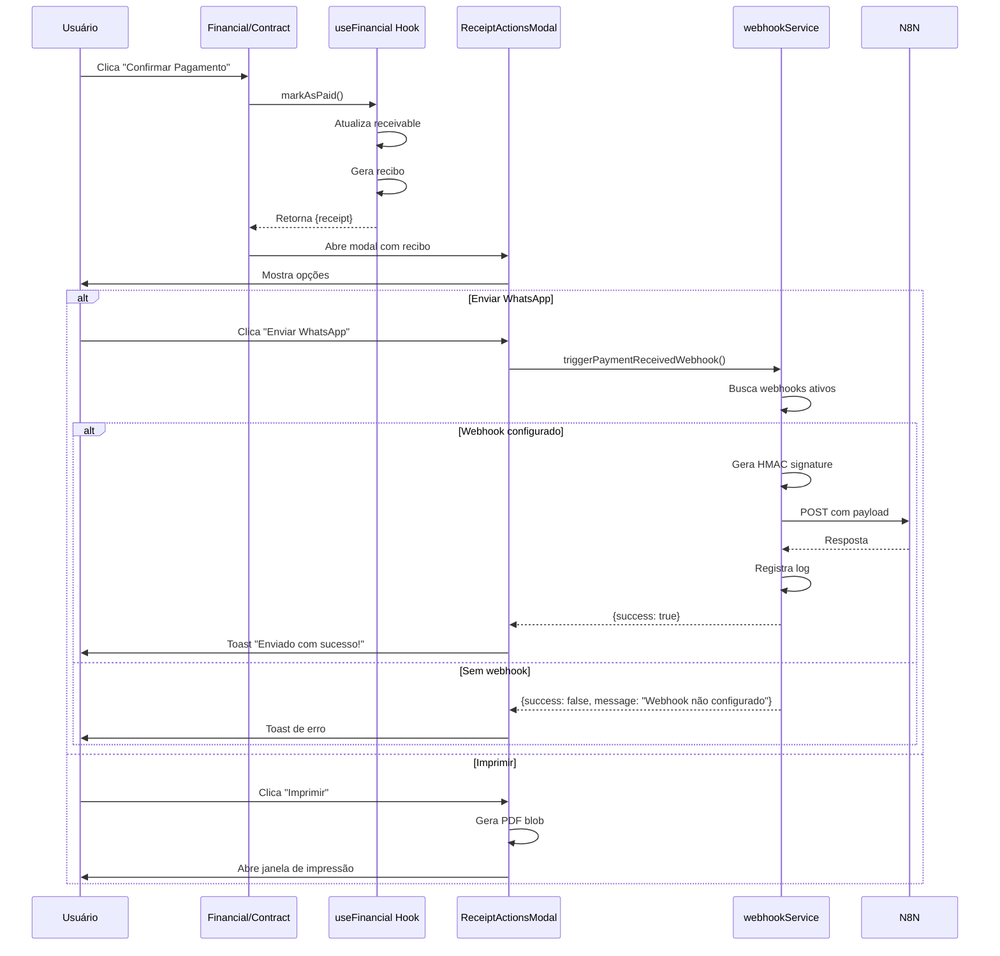

# Modal de Ações Pós-Pagamento - Implementação Completa

## Objetivo

Implementar um modal que aparece automaticamente após o registro de pagamento, oferecendo duas opções ao usuário:

1. **Enviar via WhatsApp**: Dispara webhook `payment.received` para N8N
2. **Imprimir Recibo**: Abre o PDF do recibo para impressão

## Arquivos Criados

### 1. [webhookService.ts](file:///c:/Projetos/kanban/src/lib/webhookService.ts)

Serviço responsável por disparar webhooks manualmente quando o usuário solicita envio via WhatsApp.

**Funcionalidades**:

- Busca webhooks ativos configurados para o evento `payment.received`
- Gera assinatura HMAC-SHA256 para segurança
- Envia payload completo com dados do recibo, cliente e pagamento
- Registra logs de sucesso/erro na tabela `webhook_logs`
- Retorna feedback apropriado para o usuário

**Payload Enviado**:

```json
{
  "event": "payment.received",
  "timestamp": "2025-12-30T14:00:00.000Z",
  "data": {
    "receipt": {
      "id": 123,
      "receipt_number": "REC-2025-001",
      "amount": 320.00,
      "receipt_date": "2025-12-30",
      ...
    },
    "client": {
      "id": 45,
      "full_name": "Angelo Moreira",
      "cpf": "123.456.789-00",
      "phone": "(11) 98765-4321"
    },
    "payment": {
      "amount": 320.00,
      "payment_method": "PIX",
      "payment_date": "2025-12-30"
    }
  }
}
```

### 2. [ReceiptActionsModal.tsx](file:///c:/Projetos/kanban/src/components/modals/ReceiptActionsModal.tsx)

Componente modal que apresenta as opções de ação após o pagamento.

**Funcionalidades**:

- Exibe informações do recibo (número, valor, cliente)
- Botão "Enviar WhatsApp" com loading state
- Botão "Imprimir" que abre PDF em nova janela
- Botão "Baixar PDF" adicional
- Tratamento de erros com mensagens apropriadas

**Estados**:

- `isSendingWhatsApp`: Controla loading do botão de envio
- Mostra "Webhook não configurado" se não houver webhooks ativos

## Integrações Realizadas

### [Financial.tsx](file:///c:/Projetos/kanban/src/pages/erp/Financial.tsx)

**Mudanças**:

1. Importado `ReceiptActionsModal` e tipo `Receipt`
2. Adicionado estados `receiptActionsModalOpen` e `generatedReceipt`
3. Atualizado `handleMarkAsPaid` para:
   - Usar `await` e capturar o resultado da mutação
   - Abrir o modal de ações com o recibo gerado
4. Adicionado componente `ReceiptActionsModal` no final do JSX

### [ContractDetailsModal.tsx](file:///c:/Projetos/kanban/src/components/modals/ContractDetailsModal.tsx)

**Mudanças**:

1. Importado `ReceiptActionsModal` e tipo `Receipt`
2. Adicionado estados `receiptActionsModalOpen` e `generatedReceipt`
3. Convertido `handleRegisterPayment` para async/await
4. Integrado abertura do modal após pagamento bem-sucedido
5. Adicionado componente `ReceiptActionsModal` no final do JSX

## Fluxo de Funcionamento



## Configuração de Webhook N8N

Para que o envio via WhatsApp funcione, é necessário:

1. **Acessar Settings > System > Webhooks**
2. **Criar novo webhook**:

   - Nome: Ex: "WhatsApp Recibos"
   - URL: URL do seu workflow N8N
   - Eventos: Marcar `payment.received`
   - Status: Ativo

3. **No N8N**, criar workflow que:
   - Recebe webhook POST
   - Valida assinatura HMAC (opcional mas recomendado)
   - Extrai dados do payload
   - Envia mensagem WhatsApp com informações do recibo

## Segurança

O webhook utiliza assinatura HMAC-SHA256:

- Header `X-Webhook-Signature` contém a assinatura
- Header `X-Webhook-Event` identifica o evento
- Secret é gerado automaticamente na criação do webhook
- N8N pode validar a assinatura para garantir autenticidade

## Tratamento de Erros

| Cenário                          | Comportamento                                    |
| -------------------------------- | ------------------------------------------------ |
| Webhook não configurado          | Toast: "Webhook não configurado."                |
| Erro na requisição               | Toast: "Falha ao enviar para todos os webhooks." |
| Timeout                          | Registrado em logs, toast de erro                |
| Sucesso parcial                  | Toast mostra quantos webhooks receberam          |
| Bloqueador de pop-up (impressão) | Toast: "Bloqueador de pop-ups ativado..."        |

## Logs e Monitoramento

Todos os envios de webhook são registrados em `webhook_logs`:

- `subscription_id`: ID do webhook
- `event_type`: "payment.received"
- `status_code`: Código HTTP da resposta
- `response_body`: Corpo da resposta (limitado a 1000 chars)
- `duration_ms`: Tempo de resposta
- `error_message`: Mensagem de erro (se houver)

Acesse os logs em **Settings > System > Webhooks > Ver Logs**

## Pontos de Teste

- [ ] **Financial Page**: Registrar pagamento e verificar modal
- [ ] **Contract Details**: Registrar pagamento via modal de contrato
- [ ] **Sem Webhook**: Verificar mensagem de erro apropriada
- [ ] **Com Webhook**: Verificar envio e logs
- [ ] **Impressão**: Verificar abertura do PDF
- [ ] **Download**: Verificar download do PDF
- [ ] **Loading States**: Verificar estados de carregamento
- [ ] **Múltiplos Webhooks**: Testar com 2+ webhooks configurados

## Próximos Passos (Opcional)

- Adicionar opção de reenviar recibo de pagamentos já realizados
- Permitir personalização da mensagem WhatsApp
- Adicionar preview da mensagem antes de enviar
- Suporte a outros canais (email, SMS)
